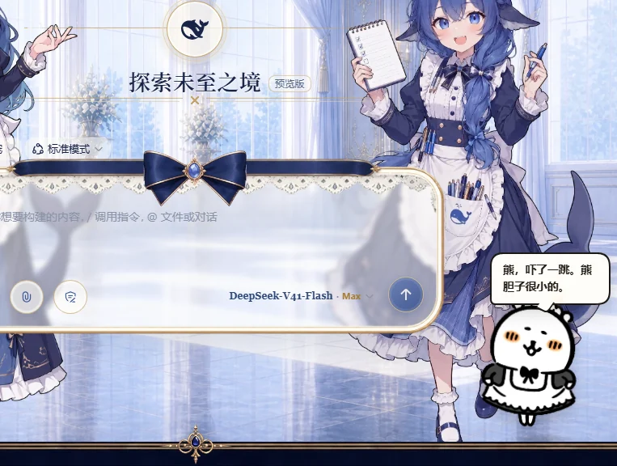
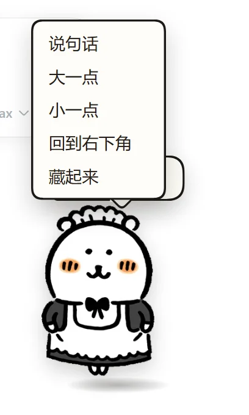
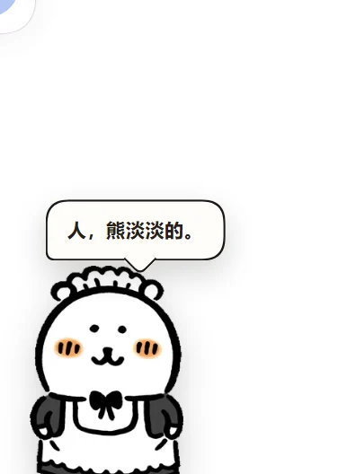

# 自嘲熊桌宠 · Zichaoxiong Pet

> A small desk pet for the **DeepSeek Harness (DSH) web GUI**: a maid-dressed
> 自嘲熊 (Nagano's *Joke Bear*) that sits still in the corner, tells you what the
> agent is doing, and never gets in the way.

[English](README.md) | [中文](README.zh.md)

[](https://github.com/Aureole2009/zichaoxiong-pet/actions/workflows/ci.yml)




**It is still by default.** It only animates when you click or drag it — no idle
bouncing, no sparkling, no distraction while you work.

## Features

| | |
| --- | --- |
| 🐻 **Lives in the GUI** | One floating layer, click-through everywhere except the bear itself. No extra window, no Python, no background process. |
| 🔇 **Still until touched** | A single static frame by default. Click → it sways for ~5s and stops. Drag → it reacts while you move it. |
| 💬 **Two moods** | *Working* (`熊，在搬砖。`) while the agent runs a turn, *idle* (`熊，淡淡的。`) when nothing is happening. 65 lines, all in character. |
| 📐 **Resizable** | Right-click → `大一点` / `小一点`, 8 steps from 96px to 288px. The speech bubble, its font and its tail scale with it. |
| 🧲 **Draggable, and it remembers** | Position and size persist per browser. Never leaves the frame; dragged into a corner, it stays reachable. |
| 🫥 **Hideable** | Right-click → `藏起来` leaves a tiny round button in the corner to call it back. |
| 🪶 **Self-contained** | The 7 animation frames are inlined into the bundle (~180 KB total). No static route, no asset server, no CSP surprises. |

<table>
<tr><td></td>
<td></td></tr>
<tr><td align="center">Right-click menu: size, home, hide.</td>
<td align="center">Smaller bear → smaller bubble, still above the head.</td></tr>
</table>

## Install

DSH loads a client plugin from a package it can resolve, so installation is just
"add the package to the web profile":

```bash
dsh plugin --profile web add github:Aureole2009/zichaoxiong-pet
```

That forwards to `pnpm` inside `~/.dsh/profiles/web` and appends the package to
`dsh.profile.bundles` for you.

Then **restart the GUI once** — the bundle list is read at process start:

```bash
# Ctrl-C the running `dsh web`, then:
npx @deepseek-ai/dsh web
```

Open the URL it prints (it carries a fresh token). Your sessions are kept.

<details>
<summary>Other ways to install</summary>

**From a clone** (no git needed on the target machine):

```bash
git clone https://github.com/Aureole2009/zichaoxiong-pet
dsh plugin --profile web add ./zichaoxiong-pet
```

**By hand**, if you prefer editing files yourself:

1. put this folder somewhere permanent,
2. add it to `~/.dsh/profiles/web/package.json` as a dependency
   (`"dsh-client-ui-pet-zichaoxiong": "link:/absolute/path"`),
3. append `"dsh-client-ui-pet-zichaoxiong"` to `dsh.profile.bundles`,
4. run `dsh plugin --profile web install` (or `pnpm install` in that folder),
5. restart `dsh web`.

Do **not** add a row for `ui-pet-zichaoxiong` to the profile's `cordis.patch.yml` — the
row ships inside the package, and a duplicate id makes DSH fail to boot.

</details>

## Use

| You do | It does |
| --- | --- |
| nothing | mutters something every 1–2 minutes (`熊，今天也很普通地活着。`) — one line every so often, not a chatterbox |
| send a prompt | 「熊，在搬砖。」 while the turn runs, then 「人，弄好了。熊要躺下了。」 when it finishes |
| hit an error | 「熊，搞砸了。熊先哭一下。」 |
| click it | sways once (~5s), sparkles, and says something (`熊，被戳了。熊的脸是软的。`) |
| drag it | picked up / set down lines, and it stays where you put it |
| right-click | `大一点` `小一点` `回到右下角` `藏起来` |
| come back later | 「人，你去哪了。熊一直在。」 |

The bubble always sits fully above the bear's head — only the tail tip touches. If the
bear is dragged to the very top of the window, the bubble flips below it instead.

## Make it yours

**Lines** — `lib/src/pet-lines.js`, grouped by situation (`busy` / `tool` for work,
`idle` / `night` / `morning` for calm, plus `poke`, `lift`, `drop`, `done`, `error`,
`waiting`, `away`). Add a line to an array, then:

```bash
node tools/build-client.mjs      # rebuilds lib/client.js
```

DSH's client HMR picks the new bundle up in ~500 ms — **no restart, no refresh**.

**Size, gaps, colours** — `lib/src/pet-css.js` (the `--zx-*` variables at the top) and
`SIZE_STEPS` in `lib/src/pet-core.js`.

**Your own artwork** — replace `assets/source/zichaoxiong.gif` with any animated GIF
that has a transparent background, then:

```bash
python tools/build_assets.py     # needs Pillow: re-derives frames + base64 module
node tools/build-client.mjs
```

## How it works

A DSH client plugin is two files: a host half (`lib/index.js`, a no-op here) and a
client half (`lib/client.js`) that DSH serves as a classic script. This plugin registers
one entry into the layout's `shell.overlay` slot — the frame-wide, click-through
floating layer — and reads two things from `ctx.sessions`: whether a turn is running,
and the last agent error. Nothing else, and no conversation content.

The bundle is built by a ~100-line script with no dependencies (`tools/build-client.mjs`)
that concatenates `lib/src/*.js` into the `window.__ModuleLoader__.load({…})` wrapper DSH
expects.

Longer write-up, including the traps that cost real debugging time:
[docs/dsh-client-plugin-notes.md](docs/dsh-client-plugin-notes.md).

## Development

```bash
```bash
node tools/build-client.mjs      # build the bundle
node test/verify-contract.mjs    # manifest / loader-wrapper / patch checks
node test/verify-bundler.mjs     # the bundler aborts on source it cannot handle
node test/run-harness.mjs        # full offline integration run in headless Chrome
```
```

`test/harness.html` boots the real bundle against a fake DSH page — fake module loader,
fake React, fake `shell.overlay` slot, fake session store — and drives 50 assertions
(mount, click-through, state reactions, resize, hide/restore, clean unmount). Two more
pages cover the edges: `harness-fallback.html` (8) for a layout that never declares the
slot, and `harness-stale-error.html` (7) for a session that still carries an error from an
earlier turn. CI runs the same four commands on every push.

## Uninstall

```bash
dsh plugin --profile web remove dsh-client-ui-pet-zichaoxiong
```

then restart `dsh web`. (If you added a row to the profile `cordis.patch.yml` by hand,
remove those two lines too.)

## License

- **Code — MIT.** See [LICENSE](LICENSE). Use it, fork it, ship it.
- **Artwork — © Nagano, non-commercial only.** The character 自分ツッコミくま /
  *Joke Bear* / 自嘲熊 belongs to **Nagano (ナガノ)** (also the author of *ちいかわ*).
  The author has stated on X that **commercial use is not permitted**, so the images in
  `assets/` and the copies inlined in `lib/client.js` are **not** MIT-licensed and may
  not be sold, monetised or used commercially. Full text: [NOTICE.md](NOTICE.md).

This is an unofficial fan project, not affiliated with or endorsed by Nagano or the
rights holders. If you are the rights holder and want the artwork gone, open an issue and
it will be removed.

## Credits

- Character and artwork: **Nagano** — *自分ツッコミくま* / *Joke Bear* / 自嘲熊.
- Plugin: built for **DeepSeek Harness** (DSH) as a `dsh-client-ui-*` client plugin.
